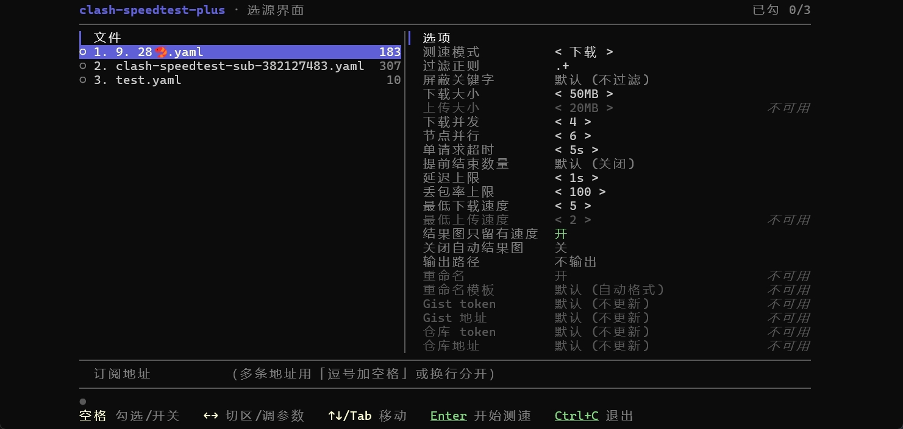
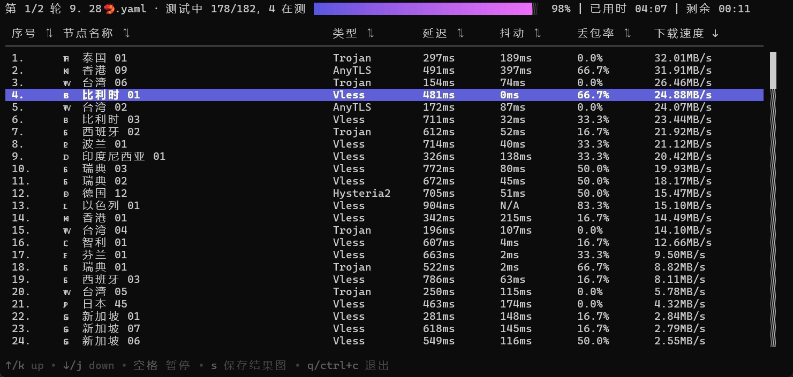
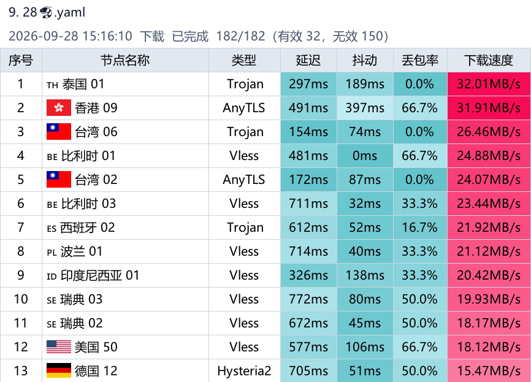

# Clash Speedtest Plus

本仓库是 [faceair/clash-speedtest](https://github.com/faceair/clash-speedtest) 的下游，协议仍为 [GPL-3.0](LICENSE)。本项目使用 Vibe Coding 开发。

基于 Clash/Mihomo 核心测代理节点：延迟、抖动、丢包、下载和上传。不依赖另外的 Clash/Mihomo 进程。不带参数打开选源界面，带参数走命令行。测完可以自动导出结果表图，把过筛节点写成 Clash 配置，再上传到 Gist 或 GitHub 仓库。

各平台二进制在 [Releases](https://github.com/BoxMiao007/clash-speedtest-plus/releases)。也可以从源码构建，见文末。

> **Windows 首次运行**：exe 没有代码签名，SmartScreen 可能提示「发布者未知」。点「仍要运行」即可。同一文件放行过一次后不再提示；重新下载的新版本第一次仍会提示。

## 选源界面

不带任何参数、并且标准输出是终端时打开。在资源管理器里双击就是这条路径。



- 左侧列出**程序文件所在目录**里的 `.yaml`。能解开成 Clash/Mihomo 配置，并且 `proxies` 或 `proxy-providers` 里至少有一项，才能勾选。不认 `.yml`。没有节点或 yaml 坏了的文件会列出来，但不能勾。空格或点击勾选，可以多选。
- 中间填订阅地址。多条之间用「逗号加空格」或换行分开。不带空格的逗号仍是 URL 的一部分，避免把查询串切开。
- 右侧是测速选项。左右键调整当前项：模式循环，数字按步长增减。点 `<` 减、点 `>` 加，点数值本身只选中。开关只有点中「开/关」（左右各带一格）才翻转，点标签只是选中；选中后空格和左右键仍可切换。
- 切换测速模式时，数字步进项和三个开关恢复界面默认值，灰掉的项也重置。过滤正则、屏蔽关键字、输出路径、重命名模板、Gist/仓库、测速服务器、拉取订阅 UA，以及已填地址、已勾配置都保留。只选中模式行不会重置。
- 「输出路径」行是**输出模式**三态，左右键或点 `<` `>` 循环：**关闭**（默认，不写输出配置）→ **自定义** → **默认当前路径**。在关闭或默认当前路径态打字会自动跳到自定义并进入编辑；切换测速模式时三态与已填词干都保留。
- 自定义态沿用**后缀补全**：回车开始测速、校验通过那一刻落定——`result` 落定为 `result.yaml`，自带 `.yml` 原样保留，留空视同关闭、正常开始测速；以 `/` 或 `\` 结尾是目录意图，状态行报「输出路径」不合法且不开始测速。落定后的值一直显示，含按 Esc 返回选源界面时。
- 默认当前路径态不用填词干：本地配置按「基名-导出.yaml」自动命名（如 `1.机场A-导出.yaml`），订阅轮没有基名用「导出-时间戳」兜底。产物序号、重命名、Gist/仓库上传与自定义态一视同仁。
- 回车开始测速。多个源**不混测**：每个勾选的配置、每条订阅各自一轮，自动连续测完。整个队列由同一个界面程序承载，本轮测完、产物保存完直接进入下一轮的界面，不再逐轮重启。状态行写「第 X/N 轮」和当轮源名。某个源解析出 0 个节点就提示并跳过，不废掉后面的轮。
- 测速界面按 **Esc** 回到这里：本轮中断，剩余轮作废，不写产物。勾选、地址和选项都还在。选源界面本身只能用 Ctrl+C 退出，`q` 和 Esc 都不退出。
- 选项不跨进程记忆。同一次运行里按 Esc 返回，选项仍保留。

界面默认值照顾直接双击，和命令行默认不完全一样：

| 项 | 界面默认 |
| --- | --- |
| 测速模式 | download |
| 下载 / 上传大小 | 50 / 20 MB |
| 下载并发 | 4 |
| 节点并行 | 6 |
| 单请求超时 | 5s |
| 提前结束数量 | 关 |
| 延迟上限 | 1s |
| 丢包率上限 | 100% |
| 最低下载 / 上传速度 | 5 / 2 MB/s |
| 结果图只留有速度 | 开 |
| 关闭自动结果图 | 关 |
| 输出模式 | 关闭 |
| 重命名 | 开 |

重命名、重命名模板、Gist 和仓库各项，要输出开着（自定义态填了词干，或选了默认当前路径）才能改。快速模式里下载相关项不可用；只有完整模式才改上传大小和最低上传速度。

管道或没有终端时，不带参数会打印用法并以非 0 退出。带任何参数（含 `-h`、`-v`）不进选源界面。

## 测速界面



- **空格**：暂停或继续。暂停后不再开新节点，已经在测的会跑完。全部测完或提前结束后空格无效。
- **s**：把当前表存成结果图。`-no-image` 只关自动导出，关不掉手动保存。正在保存时再按一次会被忽略。
- **q 或 Ctrl+C**：退出整个进程，不只关界面。本轮还没结束时立刻丢掉在测节点，不写 yaml，也不写自动结果图。整轮结束后第一次按会先等本地文件写完；再按一次强制退出，半截文件会删掉。
- **Esc**：从选源界面进来时，返回选源界面。命令行启动时，Esc 只关闭详情。
- 点某一行打开详情，再点同一行关掉。还在测的行打开的是占位详情，测完后自动换成完整详情。点表头排序。拖滚动条只滚动，不改选中。
- 默认跟着最新条目滚。向上滚（键盘、滚轮、拖滚动条）取消跟随，滚回底部恢复。点表头排序也会取消跟随并回到顶部。

非交互（管道、没有终端）输出 TSV，没有暂停。

## 命令行

```bash
go install github.com/BoxMiao007/clash-speedtest-plus@latest

clash-speedtest-plus -v
clash-speedtest-plus -h
```

完整参数以 `-h` 为准。常用项：

```
用法：clash-speedtest-plus [选项]
  -c string
        配置文件路径，也支持 http(s) 地址；逗号分隔多个源，每个源各自一轮
  -f string
        按节点名过滤，使用正则（默认 .+）
  -b string
        按关键字屏蔽节点，多个关键字用 | 分隔
  -o string
        输出配置文件路径，不带 .yaml/.yml 后缀时自动补 .yaml（也可写 -output）
  -p int
        同时测试的节点数（也可写 -parallel，默认 1）
  -concurrent int
        同一节点的下载并发连接数（默认 4）
  -speed-mode string
        测速模式：fast、download、full（默认 download）
  -fast
        快速模式，等同 -speed-mode fast
  -download-size int
        下载测试大小，单位 MB（默认 50）
  -upload-size int
        上传测试大小，仅完整模式，单位 MB（默认 20）
  -timeout duration
        单个请求超时（默认 5s）
  -early-stop int
        过筛结果达到该数量后提前结束（0 为关闭）
  -max-latency duration
        过滤高于该值的延迟（默认 1s）
  -max-packet-loss float
        过滤高于该值的丢包率，单位 %（默认 100）
  -min-download-speed float
        过滤低于该值的下载速度，单位 MB/s（默认 5）
  -min-upload-speed float
        过滤低于该值的上传速度，单位 MB/s，仅完整模式（默认 2）
  -no-image
        关闭自动导出结果图；交互界面按 s 仍可手动保存
  -image-speed-only
        结果图只保留下载或上传速度大于 0 的行；快速模式会忽略
  -rename
        用 IP 位置和速度重命名输出节点（默认开启）
  -rename-template string
        重命名模板（Go text/template）。空为默认格式
  -server-url string
        测速服务器地址或直接下载地址
  -ua string
        拉取 http(s) 配置时的 User-Agent（默认 mihomo 内核 UA）
  -gist-token string
        用于更新 Gist 的 GitHub token
  -gist-address string
        要更新的 Gist 地址或 ID
  -repo-token string
        用于更新仓库文件的 GitHub token
  -repo-address string
        仓库地址或 owner/repo
  -repo-file-path string
        仓库中的文件路径（默认使用输出文件名）
  -repo-branch string
        仓库分支（默认使用仓库默认分支）
  -v
        显示版本信息
```

**节点并行**是 `-p` / `-parallel`：同时测几个节点。命令行默认 `1`，选源界面默认 `6`。**下载并发**是 `-concurrent`：同一个节点开几条连接。不要混用，两套默认也不是 bug。

`-c` 里多个源用逗号分开，逗号两侧的空格会被去掉。每个源各自一轮。选源界面地址框的规则不同，见上一节：必须「逗号加空格」或换行。

```bash
# 测一份本地配置
clash-speedtest-plus -c ~/.config/clash/config.yaml

# 只测名字匹配的节点
clash-speedtest-plus -c ~/.config/clash/config.yaml -f 'HK|港'

# 延迟低于 800ms、下载大于 5MB/s 的节点写成配置
clash-speedtest-plus -c config.yaml -o filtered.yaml -max-latency 800ms -min-download-speed 5

# 过筛满 20 个就不再开新节点。已经在测的会跑完，最终数量可能略超 20
clash-speedtest-plus -c config.yaml -o filtered.yaml -early-stop 20

# 只测延迟
clash-speedtest-plus -c config.yaml -fast

# 本地配置和订阅各测一轮
clash-speedtest-plus -c "config.yaml, https://example.com/sub?token=secret"

# Windows CMD：地址里有 & 时必须用双引号，单引号不会保护它
clash-speedtest-plus -c "https://domain.com/api/v1/client/subscribe?token=secret&flag=meta"
```

快速模式不按下载、上传速度过滤。上传速度过滤只在完整模式生效。

## 订阅

订阅不必已经是 Clash 配置。选源界面和命令行同一套顺序：

1. 原样当 yaml；
2. 不行则整段 base64 解码后再当 yaml；
3. 还不行，且地址里没有 `flag` 参数时，补上 `flag=meta` 再请求，重复前两步。

解开后只要 `proxies` 或 `proxy-providers` 里至少有一项就停。实际用了补过参数的地址会提示出来，不改你原来写的那条。不认分享链接（`vmess://` 等），也不认 JSON。

拉取按 User-Agent 分流。选源界面默认带 `clash.meta`，可在「拉取订阅 UA」改成别的标识，改完重试立即生效。命令行 `-c` 走 mihomo 内核自己的 UA；`-ua` 留空时不覆盖它。

## 产物

结果图，以及相对路径的 `-o`，写到**程序文件所在目录**，不是启动时的当前目录。绝对路径照写。`go run` 的程序目录是临时构建目录，产物不会落在仓库根。

输出路径会做后缀补全：文件名段不以 `.yaml` / `.yml` 结尾（不分大小写）时自动补 `.yaml`——`-o result` 落定为 `result.yaml`，`result.txt` 落定为 `result.txt.yaml`；以点结尾的半截扩展名直接接 `yaml`（`result.` → `result.yaml`）；只打 `.yaml`、`.yml` 或裸点原样保留；目录段里的点不影响判定（`./v1.2/out` → `out.yaml`）。`.yml` 是唯一能原样保留的自定义后缀。以 `/` 或 `\` 结尾是目录意图，启动即报「输出路径」不合法。命令行 `-o` 留空仍是不输出；选源界面用「输出模式」三态（见上一节），关闭即不输出。补全发生在最前，最终文件名仍按下面的规则叠加基名与序号。



整轮结束（全部测完，或提前结束且已在测的节点收完）立刻写输出配置（输出开启时：命令行填了 `-o`，或选源界面的输出模式不是关闭），并自动导出结果图。`-no-image` 关掉自动导出。写盘失败会报错，退出码非 0。Gist / 仓库上传失败不影响退出码。

文件名规则：

- 最前是产物序号 `N.`。启动时扫程序目录里已有的、以 `N.` 开头的 png，从最大号接着编。旧版无号图不计数。多轮按队列位置递增，跳过的轮也占号，和界面上的「第 X/N 轮」对齐。
- 本地配置的基名会进文件名。结果图如 `3.机场A-20260927-153000.png`；填了输出路径时如 `3.机场A-result.yaml`。基名去掉扩展和非法字符，最长 40 个字符。
- 订阅没有可跟的文件名。结果图用默认前缀 `clash-speedtest-plus`，输出配置靠序号区分，如 `3.result.yaml`。拉取订阅写出的临时文件名不会进产物。
- 输出模式选「默认当前路径」时不填词干：本地配置按「基名-导出.yaml」命名（如 `3.机场A-导出.yaml`），订阅轮用「导出-时间戳」兜底（如 `4.导出-20260929-153001.yaml`）。
- 同一秒重名则加 `-1`、`-2`，不覆盖。

结果图是浅色表格 PNG，不是终端截图。节点名用订阅原名，不跟 `-rename` 之后的名字。各指标列的颜色按本批该列的最小到最大值上色，下载列和上传列互不影响。图顶是来源（文件名，或去掉查询参数的订阅地址）和摘要（时间、模式、状态、完成数）。「结果图只留有速度」开启时，摘要里再给出有效、无效、测试中、未测试，为 0 的项省略。快速模式会忽略这个开关。

`-rename` 默认开启，只作用在输出配置上，不影响结果图。默认名称形如 `🇺🇸 US 001 | ⬇️ 15.67MB/s`。自定义用 `-rename-template`，占位符：

`{{.Flag}}` `{{.CountryCode}}` `{{.Index}}` `{{.Direction}}` `{{.Speed}}` `{{.SpeedUnit}}` `{{.LatencyMs}}` `{{.DownloadSpeedMBps}}` `{{.UploadSpeedMBps}}`

查不到 IP 位置的节点保持原名。模板解析失败时改用默认名称。

## 上传到 GitHub

写了输出配置（命令行 `-o`，或选源界面的输出模式不是关闭）并且测完之后，可以把这份 yaml 更新到 Gist 或仓库。交互模式在后台上传，离开界面不等它；非交互等到成功或失败再退出。上传走环境变量 `HTTPS_PROXY` / `HTTP_PROXY`。不要把 token 提交进仓库。

### Gist

用 classic PAT，只勾 `gist`。

```bash
clash-speedtest-plus -c config.yaml -o result.yaml \
  -gist-token "ghp_xxx" \
  -gist-address "https://gist.github.com/user/abc123"
```

`-gist-address` 可以是完整 URL，也可以是 Gist ID。上传的文件名用输出文件的基名。

### 仓库文件

Fine-grained PAT：目标仓库的 `Contents` 设为 Read and write。Classic PAT：公开仓库至少 `public_repo`，私有仓库至少 `repo`。

```bash
clash-speedtest-plus -c config.yaml -o result.yaml \
  -repo-token "ghp_xxx" \
  -repo-address "user/repo"

# 指定分支和路径
clash-speedtest-plus -c config.yaml -o result.yaml \
  -repo-token "ghp_xxx" \
  -repo-address "https://github.com/user/repo" \
  -repo-file-path "configs/subscriptions/result.yaml" \
  -repo-branch "main"
```

没填 `-repo-file-path` 时，写到默认分支，文件名与输出文件相同。

- `401`：token 无效、过期，或复制时带了空格、换行。
- `403`：权限不够，或分支保护不允许直接提交。
- `404`：仓库、路径或分支不对，或 token 看不到这个仓库。

## 测速原理

默认下载 `https://dl.google.com/chrome/mac/universal/stable/GGRO/googlechrome.dmg`，用耗时算下载速度。`speed.cloudflare.com` 容易返回 403，所以不再当默认入口。

`-server-url` 不带 path 时（例如 `https://speed.cloudflare.com`，或自建服务），用 `/__down` 和 `/__up` 测下载和上传。带 path 时当成直接下载地址，只测下载。

要测上传，显式用完整模式：

```bash
clash-speedtest-plus -c config.yaml \
  --server-url "https://speed.cloudflare.com" \
  --speed-mode full
```

自建测速服务在本仓库的 `download-server/`：

```bash
go install github.com/BoxMiao007/clash-speedtest-plus/download-server@latest
download-server

clash-speedtest-plus -c config.yaml \
  --server-url "http://your-server-ip:8080" \
  --speed-mode full
```

三种模式：

- `fast`：只测延迟、抖动、丢包。
- `download`（默认）：再测下载。
- `full`：再测上传。

延迟是拿到第一个字节的时间（TTFB）。下载速度是下完指定大小的平均速度。两者独立：带宽高不一定延迟低。

## 从源码构建

需要 Go 1.24。

```bash
go build -o clash-speedtest-plus .
go test ./...
```

本地构建的 `-v` 显示 `dev` / `unknown`。发布二进制由打 git tag 触发，并带 `-tags=with_gvisor`。版本号次位只到 9：`1.9` 之后是 `2.0.0`，没有 `1.10`。

## 注意事项

**OpenWRT**：测速时建议先关掉 OpenClash / Clash / Mihomo，避免路由冲突。或者加进程直连：

```yaml
rules:
  - PROCESS-NAME,clash-speedtest-plus,DIRECT
```

**Windows CMD**：订阅地址里有 `&` 时用双引号。单引号不会把它当成普通字符。

## License

[GPL-3.0](LICENSE)

## 上游 README

下面是 [faceair/clash-speedtest](https://github.com/faceair/clash-speedtest) 仓库 README 的原文，便于对照上游用法。程序名、参数和界面以本文档前面几节为准，不要拿上游说明套本仓库。

<details>
<summary>faceair/clash-speedtest README</summary>

# Clash-SpeedTest

基于 Clash/Mihomo 核心的测速工具，快速测试你的节点速度。

Features:
1. 无需额外的配置，直接将 Clash/Mihomo 配置本地文件路径或者订阅地址作为参数传入即可
2. 支持 Proxies 和 Proxy Provider 中定义的全部类型代理节点，兼容性跟 Mihomo 一致
3. 不依赖额外的 Clash/Mihomo 进程实例，单一工具即可完成测试
4. 代码简单而且开源，不发布构建好的二进制文件，保证你的节点安全


## Prerequisites/注意事项

### OpenWRT 环境
在 OpenWRT 环境下使用本工具时，建议临时关闭 OpenClash/Clash/Mihomo 等代理服务，以避免路由冲突影响测速结果的准确性。或者给 OpenClash/Clash/Mihomo 配置进程规则绕过代理：
```
rules:
  - PROCESS-NAME,clash-speedtest,DIRECT
```

### Windows CMD 用户
在 Windows CMD 中使用时，如果订阅地址包含 `&` 字符，必须使用双引号而非单引号：
```bash
# 正确
> clash-speedtest -c "https://domain.com/api/v1/client/subscribe?token=secret&flag=meta"

# 错误
> clash-speedtest -c 'https://domain.com/api/v1/client/subscribe?token=secret&flag=meta'
```

## 使用方法

```bash
# 支持从源码安装，或从 Release 里下载由 Github Action 自动构建的二进制文件
> go install github.com/faceair/clash-speedtest@latest

# 查看版本
> clash-speedtest -v

# 查看帮助
> clash-speedtest -h
Usage of clash-speedtest:
  -c string
        configuration file path, also support http(s) url
  -ua string
        User-Agent for fetching config from http(s) URL (default: mihomo kernel UA, e.g. mihomo/1.10.0)
  -f string
        filter proxies by name, use regexp (default ".*")
  -b string
        block proxies by keywords, use | to separate multiple keywords (example: -b 'rate|x1|1x')
  -server-url string
        server url or direct download url (default "https://dl.google.com/chrome/mac/universal/stable/GGRO/googlechrome.dmg")
  -speed-mode string
        speed test mode: fast, download, full (default "download")
  -download-size int
        download size for testing proxies (default 50MB)
  -upload-size int
        upload size for testing proxies (full mode only) (default 20MB)
  -timeout duration
        timeout for testing proxies (default 5s)
  -concurrent int
        download concurrent size (default 4)
  -output string
        output config file path; .yaml is appended when the file name has no .yaml/.yml suffix (default "")
  -max-latency duration
        filter latency greater than this value (default 800ms)
  -max-packet-loss float
        filter packet loss greater than this value(unit: %) (default 100)
  -min-download-speed float
        filter speed less than this value(unit: MB/s) (default 5)
  -min-upload-speed float
        filter upload speed less than this value(unit: MB/s, full mode only) (default 2)
  -early-stop int
        stop testing after this many results pass filters (0 disables)
  -rename
        rename nodes with IP location and speed
  -fast
        fast mode (alias for --speed-mode fast)
  -gist-token string
        GitHub personal access token for gist upload
  -gist-address string
        gist URL or ID for uploading output file (filename uses output basename)
  -repo-token string
        GitHub personal access token for repository file upload
  -repo-address string
        repository URL or owner/repo for uploading output file
  -repo-file-path string
        repository file path for uploading output file (default: output basename)
  -repo-branch string
        repository branch for uploading output file (default: repository default branch)

# 演示：

# 1. 测试全部节点，使用 HTTP 订阅地址
# 请在订阅地址后面带上 flag=meta 参数，否则无法识别出节点类型
> clash-speedtest -c 'https://domain.com/api/v1/client/subscribe?token=secret&flag=meta'

# 2. 测试香港节点，使用正则表达式过滤，使用本地文件
> clash-speedtest -c ~/.config/clash/config.yaml -f 'HK|港'
节点                                        	带宽          	延迟
Premium|广港|IEPL|01                        	484.80KB/s  	815.00ms
Premium|广港|IEPL|02                        	N/A         	N/A
Premium|广港|IEPL|03                        	2.62MB/s    	333.00ms
Premium|广港|IEPL|04                        	1.46MB/s    	272.00ms
Premium|广港|IEPL|05                        	3.87MB/s    	249.00ms

# 3. 当然你也可以混合使用
> clash-speedtest -c "https://domain.com/api/v1/client/subscribe?token=secret&flag=meta,/home/.config/clash/config.yaml"

# 4. 筛选出延迟低于 800ms 且下载速度大于 5MB/s 的节点，并输出到 filtered.yaml
> clash-speedtest -c "https://domain.com/api/v1/client/subscribe?token=secret&flag=meta" -output filtered.yaml -max-latency 800ms -min-download-speed 5
# 筛选后的配置文件可以直接粘贴到 Clash/Mihomo 中使用，或是贴到 Github\Gist 上通过 Proxy Provider 引用。
# 如果只需要前 20 个满足筛选条件的节点，可以加 -early-stop 20，达到数量后会停止继续测速。

# 5. 使用 -rename 选项按照 IP 地区和下载速度重命名节点
> clash-speedtest -c config.yaml -output result.yaml -rename
# 重命名后的节点名称格式：🇺🇸 US 001 | ⬇️ 15.67MB/s
# 包含国旗 emoji、国家代码和下载速度

# 6. 快速测试模式
> clash-speedtest -f 'HK' -fast -c ~/.config/clash/config.yaml
# 此命令将只测试节点延迟，跳过其他测试项目，适用于：
# - 快速检查节点是否可用
# - 只需要检查延迟的场景
# - 需要快速得到测试结果的场景
🇭🇰 香港 HK-10 100% |██████████████████| (20/20, 13 it/min)
序号    节点名称                类型            延迟
1.      🇭🇰 香港 HK-01           Trojan          657ms
2.      🇭🇰 香港 HK-20           Trojan          649ms
3.      🇭🇰 香港 HK-15           Trojan          674ms
4.      🇭🇰 香港 HK-19           Trojan          649ms
5.      🇭🇰 香港 HK-12           Trojan          667ms

# 7. 上传到 GitHub Gist
> clash-speedtest -c config.yaml -output result.yaml -gist-token "ghp_xxx" -gist-address "https://gist.github.com/user/abc123"
# 测试完成后，会将 result.yaml 上传到指定的 Gist，文件名与 -output 保持一致（去除目录前缀）
# gist-address 可以是完整的 Gist URL，也可以是 Gist ID（如 abc123）
# Gist/Repo 上传与远程配置 URL 加载默认遵循环境代理变量（HTTPS_PROXY/HTTP_PROXY）。

# 8. 上传到 GitHub 仓库文件（默认写入 output 文件名）
> clash-speedtest -c config.yaml -output result.yaml -repo-token "ghp_xxx" -repo-address "user/repo"
# 测试完成后，会将 result.yaml 上传到仓库默认分支下的 result.yaml

# 9. 上传到 GitHub 仓库指定分支与路径
> clash-speedtest -c config.yaml -output result.yaml -repo-token "ghp_xxx" -repo-address "https://github.com/user/repo" -repo-file-path "configs/subscriptions/result.yaml" -repo-branch "main"
```

## GitHub Token 创建与权限

### 1) 更新 Gist（`-gist-token`）

推荐使用 **Personal access tokens (classic)**：

1. 打开 GitHub `Settings` → `Developer settings` → `Personal access tokens` → `Tokens (classic)`。
2. 点击 `Generate new token (classic)`。
3. 仅勾选最小权限：`gist`。
4. 生成后复制 token，作为 `-gist-token` 传入。

最小权限结论：
- `gist`：必需（用于通过 API 更新 Gist 文件）。

### 2) 更新仓库文件（`-repo-token`）

可选两种 token：

#### A. Fine-grained PAT（推荐）

1. 打开 GitHub `Settings` → `Developer settings` → `Personal access tokens` → `Fine-grained tokens`。
2. `Repository access` 选择目标仓库（建议 `Only select repositories`）。
3. 在 `Repository permissions` 中设置：
   - `Contents`: **Read and write**（必需）
4. 生成后复制 token，作为 `-repo-token` 传入。

#### B. Tokens (classic)

- 更新**公开仓库**文件：至少 `public_repo`。
- 更新**私有仓库**文件：至少 `repo`。

最小权限结论：
- Fine-grained PAT：`Contents: Read and write`。
- Classic PAT：公有仓库 `public_repo`，私有仓库 `repo`。

### 常见权限问题

- `401 Unauthorized`：token 无效、过期，或复制时有空格/换行。
- `403 Forbidden`：token 权限不足，或目标分支启用了保护策略（可能禁止直接 push/commit）。
- `404 Not Found`：仓库地址/路径/分支不正确，或 token 对该仓库不可见。

> 安全建议：不要把 token 提交到仓库；优先通过环境变量或 CI Secret 注入。

## 测速原理

通过 HTTP GET 请求下载指定大小的文件，默认使用 https://dl.google.com/chrome/mac/universal/stable/GGRO/googlechrome.dmg 进行测试，计算下载时间得到下载速度。因为 speed.cloudflare.com 容易返回 403，所以默认不再使用它作为测速入口。

当 server-url 不带 path 时 (使用 https://speed.cloudflare.com 或自建测速服务)，使用 /__down 和 /__up 完成下载与上传测试。
当 server-url 带 path 时，会被识别为直接下载地址，只进行下载测速。

如果你确认 https://speed.cloudflare.com 可以访问并希望测试上传，请显式设置为 full 模式，例如：
```shell
clash-speedtest --server-url "https://speed.cloudflare.com" --speed-mode full
```
或者你也可以自己搭建一个测速服务器，用来测试下载和上传速度：

```shell
# 在您需要进行测速的服务器上安装和启动测速服务器
> go install github.com/faceair/clash-speedtest/download-server@latest
> download-server

# 此时在本地使用 http://your-server-ip:8080 作为 server-url 即可
> clash-speedtest --server-url "http://your-server-ip:8080" --speed-mode full
```


测试结果：
1. 带宽 是指下载指定大小文件的速度，即一般理解中的下载速度。当这个数值越高时表明节点的出口带宽越大。
2. 延迟 是指 HTTP GET 请求拿到第一个字节的的响应时间，即一般理解中的 TTFB。当这个数值越低时表明你本地到达节点的延迟越低，可能意味着中转节点有 BGP 部署、出海线路是 IEPL、IPLC 等。

请注意带宽跟延迟是两个独立的指标，两者并不关联：
1. 可能带宽很高但是延迟也很高，这种情况下你下载速度很快但是打开网页的时候却很慢，可能是是中转节点没有 BGP 加速，但出海线路带宽很充足。
2. 可能带宽很低但是延迟也很低，这种情况下你打开网页的时候很快但是下载速度很慢，可能是中转节点有 BGP 加速，但出海线路的 IEPL、IPLC 带宽很小。

## License

[GPL-3.0](LICENSE)

</details>
